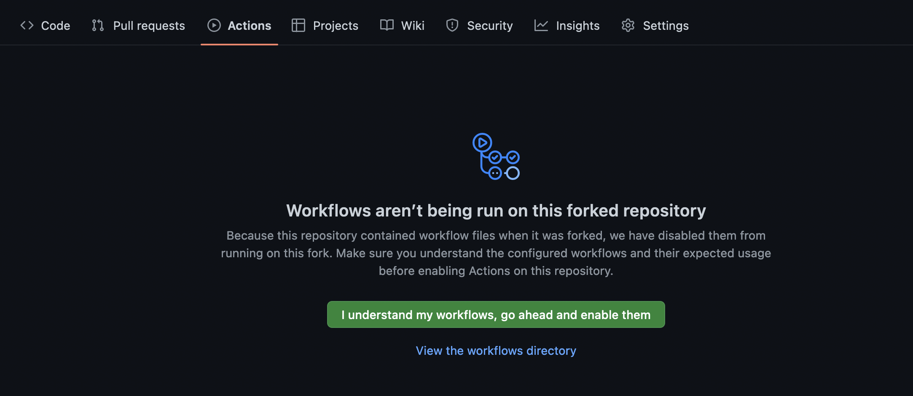

# chouseisan_script
[調整さん](https://chouseisan.com/)の候補日程を自動生成

## 使い方
1. 本リポジトリを**fork**
2. **Actions >> I understand my workflows, go ahead and enable them**をクリック

2. [setting.csv](./setting.csv)を変更して**push**
3. **Github Actions**を用いて自動実行
4. [output.txt](./output.txt)を[調整さん](https://chouseisan.com/)にコピペ

## setting.csvについて
- setting.csvの例
  - 2022年08月15日~08月23日の期間, 13時から19時の間に2時間おきに候補日程が生成されます。
    - 曜日の行を0にすると、その曜日は候補日から除外されます。
      - この例だと土曜、日曜を除く平日のみ候補日程が生成されます。

  
~~~
year,2022
start date,08,15
finish date,08,23
monday,1
tuesday,1
wednesday,1
thursday,1
friday,1
saturday,0
sunday,0
time start,13
time finish,19
time span,2
~~~

## 生成されたoutput.txt
~~~
8/15(月) 13:00~
8/15(月) 15:00~
8/15(月) 17:00~
8/15(月) 19:00~
8/16(火) 13:00~
8/16(火) 15:00~
8/16(火) 17:00~
8/16(火) 19:00~
8/17(水) 13:00~
8/17(水) 15:00~
8/17(水) 17:00~
8/17(水) 19:00~
8/18(木) 13:00~
8/18(木) 15:00~
8/18(木) 17:00~
8/18(木) 19:00~
8/19(金) 13:00~
8/19(金) 15:00~
8/19(金) 17:00~
8/19(金) 19:00~
8/22(月) 13:00~
8/22(月) 15:00~
8/22(月) 17:00~
8/22(月) 19:00~
8/23(火) 13:00~
8/23(火) 15:00~
8/23(火) 17:00~
8/23(火) 19:00~
~~~